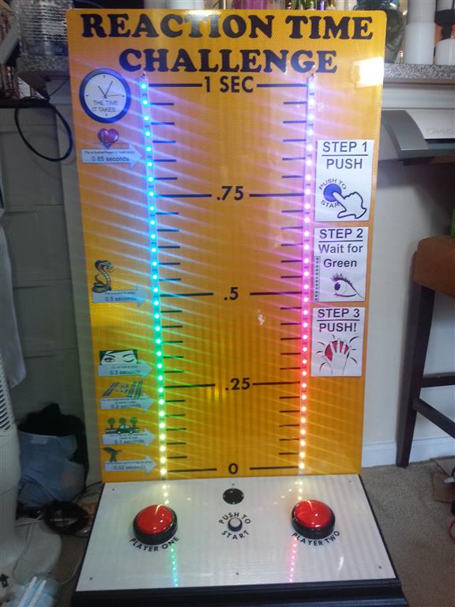

Reaction-Time-Challenge-Exhibit
===============================

The code that runs a super fun science museum exhibit! More info at http://www.billporter.info/?p=1375

Pretty 'Screen Saver' LED code by Adafruit. 

This work is licensed under the Creative Commons Attribution-ShareAlike 3.0 Unported License. To view a copy of this license, visit http://creativecommons.org/licenses/by-sa/3.0/ or send a letter to Creative Commons, 444 Castro Street, Suite 900, Mountain View, California, 94041, USA.